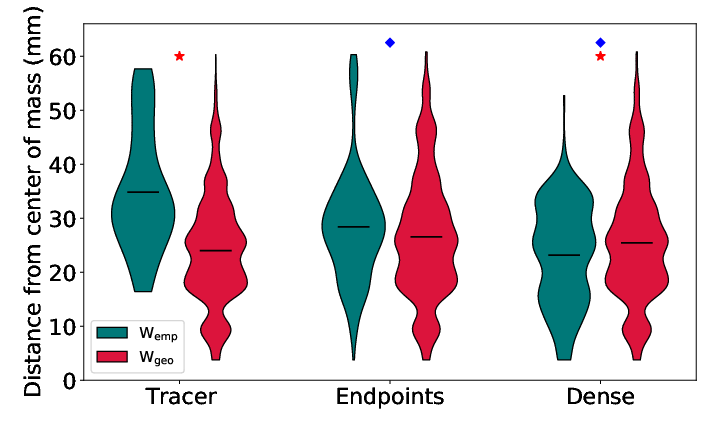

My first-author paper "The role of spatial embedding in mouse brain networks
constructed from diffusion tractography and tracer injections" is currently
under review at NeuroImage. You can download the draft <a
href="/brain_networks.pdf" target="_blank" rel="noreferrer">here</a>.

I published the analysis and visualization code I developed for this project in
a Python package called `braingraphgeo`. You can 
[check out the code here](https://github.com/scott-trinkle/braingraphgeo)!

# Highlights

- I constructed structural brain networks using diffusion MRI tractography and
  public tracer data
- I generated random geometric surrogate networks to use as a baseline for comparative
  network analysis
- I found that modular- and hub-node structure in tractography networks are heavily
  biased by geometry

# Motivation

[Diffusion MRI tractography](https://en.wikipedia.org/wiki/Tractography) is
the only way to noninvasively measure the structural connectivity of the brain,
but recent validation studies have revealed that there are severe limitations
in modern approaches.

Tractography forms "streamlines" by picking a seed point in 3D space, taking a
step in a direction determined by the local [fiber orientation distribution
function](/news/microct-paper/) (fODF), sampling a new direction from the new
fODF, taking another step, etc. Accordingly, one major problem inherent to the
method is that local errors in fiber orientations accumulate over larger
distances, so longer streamlines have more errors, causing a bias towards
connectivity between nearby structures.

Part of the challenge of detecting this bias is that the brain is itself
a **spatially-embedded network** - there is an actual, **biological** bias
towards short-range connections in addition to the **methodological** bias
imparted by tractography.

The purpose of this project was to use neural tracer data from the [Allen Mouse
Brain Connectivity Atlas](https://connectivity.brain-map.org) to distinguish
these two biases using a number of techniques from graph theory. Neural tracers
use fluorescent viruses that infect only specific pathways in the brain based on
where they were injected. With optical imaging, you can precisely quantify
regions of tracer infection, giving you close to a ground-truth measure of
connectivity between different regions.

# Strategy

Brain graphs were constructed from six diffusion MRI mouse datasets using
streamline tractography. The "nodes" in the graph were the same as those from
the tracer graph, defined as specific anatomical brain regions. The "edges" in
the tractography graphs were defined as the number of streamlines connecting any
two regions, normalized by the size of the two regions.

From these "empirical" graphs, we were inspired by a [recent
paper](https://www.sciencedirect.com/science/article/abs/pii/S105381191500806X?via%3Dihub) to construct **geometric surrogate graphs** that have the same
edge-weight distribution and weight-distance relationships as the
empirical graphs, but are otherwise randomly connected.

Using a host of analytical tools from graph theory, comparison between the
empirical and geometric surrogate graphs then allows us to quantify **the extent
to which brain network structure from each modality can be explained by the
brain's geometry alone**.

# Results

Tractography networks (blue and orange) dramatically underestimate connectivity
at long distances relative to tracers:

Tractography networks (Wemp) place their most important "hub" nodes towards the
center of the brain, similar to their corresponding geometric surrogate graphs
(Wgeo):

Tracer networks (Wemp), however, place their most important "hub" nodes further
out into the periphery of the brain, which is not observed in their
corresponding geometric surrogate graphs (Wgeo):

This effect is quantified below, where we see distributions of the distance from
the center of mass of major hub nodes in empirical and geometric graphs from
tracers and two tractography methods:

Across many other metrics, we saw a similar story: tractography graphs are not
only significantly different than ground-truth tracer graphs, but they are also
indistinguishable in many respects from random graphs with the same geometric
characteristics. This indicates that geometric bias is still a huge problem in
tractography, and demonstrates a useful analytic tool for future benchmarking of
new methods.
