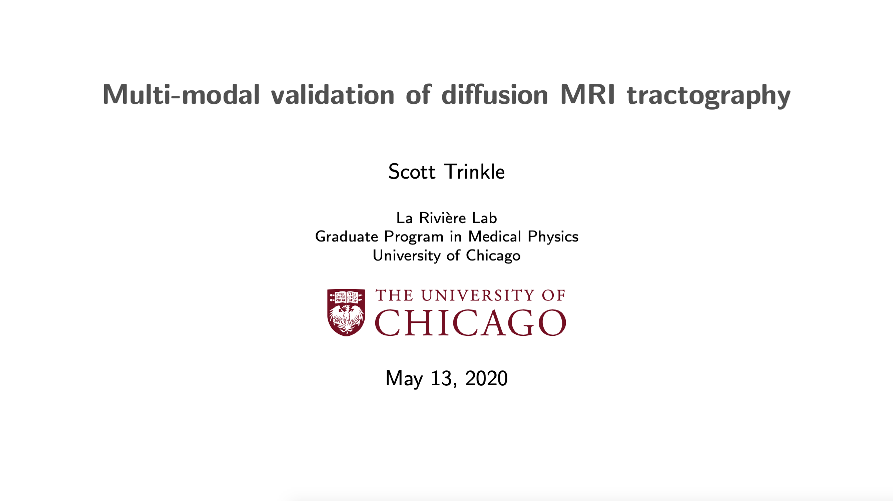

I was invited to give a talk to the University of Chicago Committee on Medical Physics entitled "Multi-modal validation of diffusion MRI tractography."

Twitter reviews were raving:

<blockquote class="twitter-tweet">
Great colloquium today with 4th year Scott Trinkle in the La Riviere Lab! Here&#39;s a slide from his talk “Multi-modal validation of diffusion MRI tractography.” <a href="https://t.co/UPKIneUOD0">pic.twitter.com/UPKIneUOD0</a>
&mdash; UChicago Medical Physics (@UChicagoMedPhys) <a href="https://twitter.com/UChicagoMedPhys/status/1260687768440668161?ref_src=twsrc%5Etfw">May 13, 2020</a></blockquote> 
