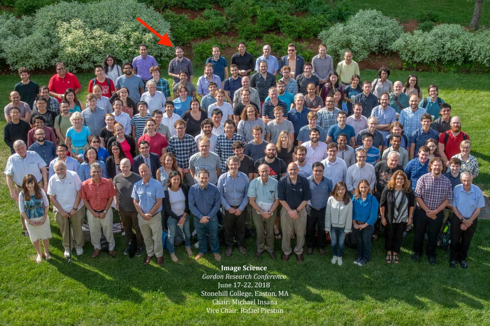
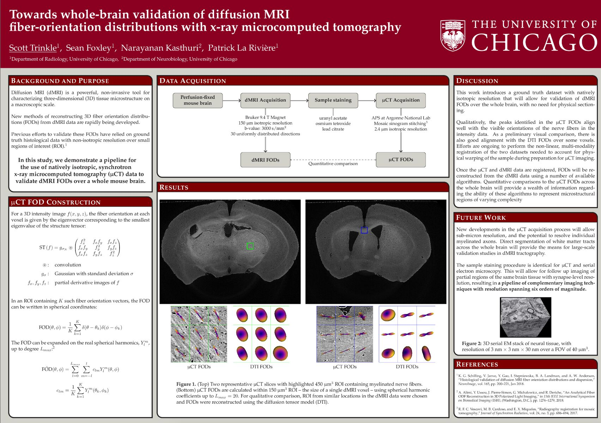

This June I attended the [Gordon Research Conference on Image
Science](https://www.grc.org/image-science-conference/2018/) in Easton,
Massachusetts. I presented preliminary results on the use of structure-tensor
analysis to extract fiber orientations from microCT data with a poster entitled
"Toward whole-brain validation of diffusion MRI fiber-orientation distributions
with x-ray microcomputed tomography." You can read my abstract <a href="./abstract.pdf"
target="_blank">here</a> and check out the poster below. 

