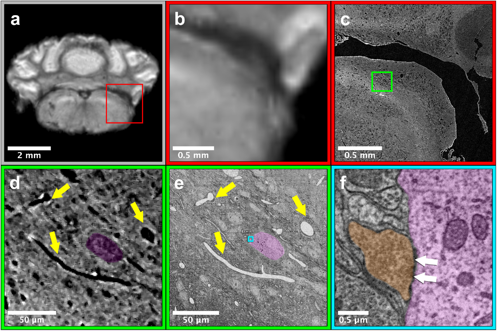

Our new paper "[Multi-modal imaging of a single mouse brain over five orders of
magnitude of
resolution](https://www.sciencedirect.com/science/article/pii/S1053811921005279?via%3Dihub)"
has been published in NeuroImage.

In this work, we demonstrate an imaging pipeline for a whole mouse brain
using

1. MRI
2. Whole-brain synchrotron x-ray microCT
3. Serial electron microscopy (EM)

With EM, we get nano-scale reconstructions of individual synapses, giving us
information we can bridge to the MRI scale using microCT as a sort of
intermediate scaffolding. This pipeline will allow unprecedented insight into
the microstructural drivers of the MRI signal, as well as help place EM
volumetric reconstructions in their anatomical context.

<a
href="http://neuroglancer-demo.appspot.com/#!%7B%22dimensions%22:%7B%22x%22:%5B0.0000012000000000000002%2C%22m%22%5D%2C%22y%22:%5B0.0000012000000000000002%2C%22m%22%5D%2C%22z%22:%5B0.0000012000000000000002%2C%22m%22%5D%7D%2C%22position%22:%5B3679.06396484375%2C6571.3544921875%2C4455.212890625%5D%2C%22crossSectionOrientation%22:%5B0.6972193717956543%2C0.7150224447250366%2C-0.014205372892320156%2C-0.04925645515322685%5D%2C%22crossSectionScale%22:0.6102521275481583%2C%22projectionOrientation%22:%5B-0.5169536471366882%2C0.47275060415267944%2C-0.5274643898010254%2C0.4806736409664154%5D%2C%22projectionScale%22:16384%2C%22layers%22:%5B%7B%22type%22:%22image%22%2C%22source%22:%22precomputed://http://nova.kasthurilab.com:8000/neuroglancer/recon_crop8_neurog/image/%22%2C%22tab%22:%22source%22%2C%22name%22:%22WholeBrain%22%7D%5D%2C%22showAxisLines%22:false%2C%22layout%22:%22xy%22%7D"
 target = "_blank" rel="noreferrer">Click here</a> to explore our entire microCT dataset online using
[Neuroglancer](https://opensource.google/projects/neuroglancer).

# Abstract

Mammalian neurons operate at length scales spanning six orders of magnitude;
they project millimeters to centimeters across brain regions, are composed of
micrometer-scale-diameter myelinated axons, and ultimately form nanometer scale
synapses. Capturing these anatomical features across that breadth of scale has
required imaging samples with multiple independent imaging
modalities. Translating between the different modalities, however, requires
imaging the same brain with each. Here, we imaged the same postmortem mouse
brain over five orders of spatial resolution using MRI, whole brain
micrometer-scale synchrotron x-ray tomography (μCT), and large volume automated
serial electron microscopy. Using this pipeline, we can track individual
myelinated axons previously relegated to axon bundles in diffusion tensor MRI or
arbitrarily trace neurons and their processes brain-wide and identify individual
synapses on them. This pipeline provides both an unprecedented look across a
single brain's multi-scaled organization as well as a vehicle for studying the
brain's multi-scale pathologies.

# My role

My primary contribution to this work was to demonstrate 3D alignment between
the three modalities:

(a) and (b) show a region of the cerebellum in the low-resolution MRI data

(c) shows the region from (b) located within the microCT data

(d) shows the green inset from (c) with highlighted microvasculature and cell bodies

(e) shows the region from (d) located within the EM data with the same annotations

(f) shows the cyan inset from (e) with a highlighted synapse between two cells
