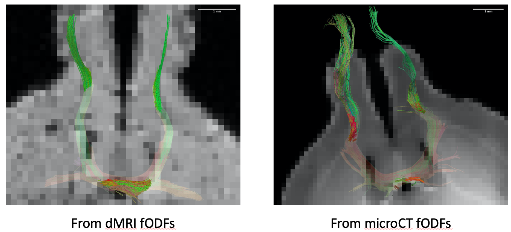
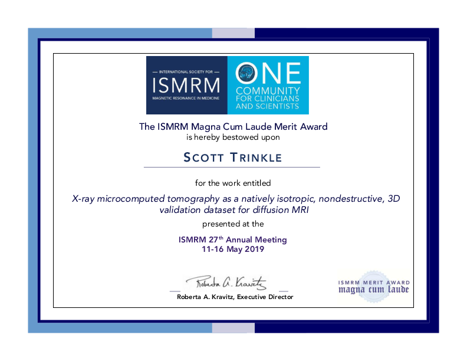
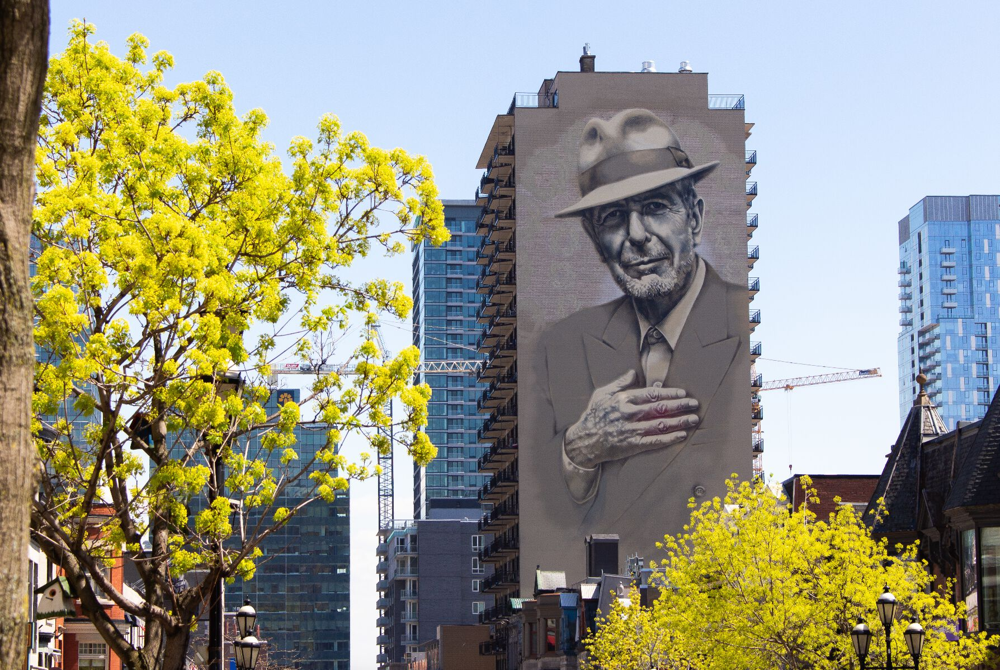

This month I attended the [ISMRM Annual Meeting ](https://www.ismrm.org/19m/) in
Montréal, Quebec to give a talk entitled "X-ray microcomputed tomography as a
natively isotropic, nondestructive, 3D validation dataset for diffusion MRI."

In this work, we used an image processing technique called ["structure tensor
analysis"](https://en.wikipedia.org/wiki/Structure_tensor) to measure the
orientations of nerve fibers in a mouse brain using high-resolution [x-ray
microCT](https://en.wikipedia.org/wiki/X-ray_microtomography). These
orientations were compared to values estimated at a much lower resolution with
[diffusion MRI](https://en.wikipedia.org/wiki/Diffusion_MRI) on the same
brain. [Fiber tractography](https://en.wikipedia.org/wiki/Tractography) results
on the anterior commissure tract shown below demonstrate that microCT can be
used to validate model-based results from diffusion MRI data. You can read my
abstract <a href="./ISMRM_abstract.pdf" target="_blank">here</a>

My talk received the Magna Cum Laude Merit Award for my session:

I was also able to explore the city a little bit and find a mural
of Leonard Cohen, one of my favorite musicians:

