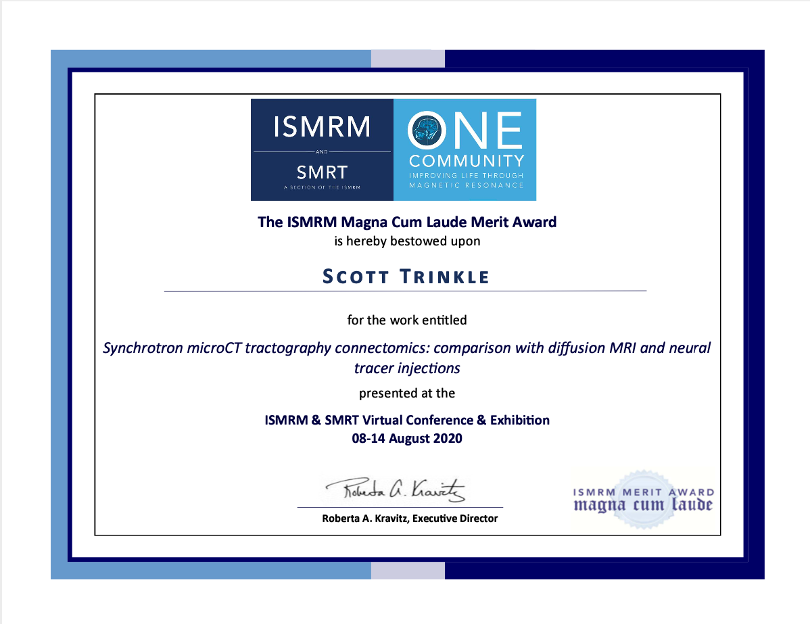

This year's [ISMRM Annual Meeting](https://www.ismrm.org/20m/) was initially
scheduled to be held this April in Sydney, Australia. As the COVID-19 pandemic
emerged, the conference was first rescheduled to be in August in Paris, France,
then later moved to a fully virtually format. While I was sad to miss out on
travel to both of those cities, I was happy to [once again](/news/ismrm-2019/)
receive a Magna Cum Laude Merit Award for my talk entitled **"Synchrotron
microCT tractography connectomics: comparison with diffusion MRI and neural
tracer injections."**

In this work, we used public neural tracer data from the [Allen Mouse
Brain Connectivity Atlas](https://connectivity.brain-map.org) to show that
1. Fiber orientations extracted from x-ray microCT data can be used with 
standard tractography pipelines
2. Both diffusion MRI and microCT tractography yield **comparable performance
to a completely random tracking approach** in terms of replicating the true
structural connectivity of the mouse brain as measured with the tracer data,
indicating **severe geometric bias in current tractography methods**

You can read my abstract <a href="./abstract.pdf" target="_blank">here</a>
and watch my presentation below:

<figure class="video_container">
  <video controls="true" allowfullscreen="true" poster="/poster.png">
    <source src="0854-trinkle.mp4" type="video/mp4">
  </video>
</figure>
