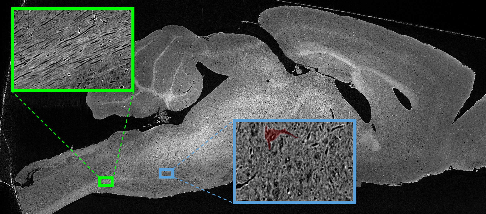
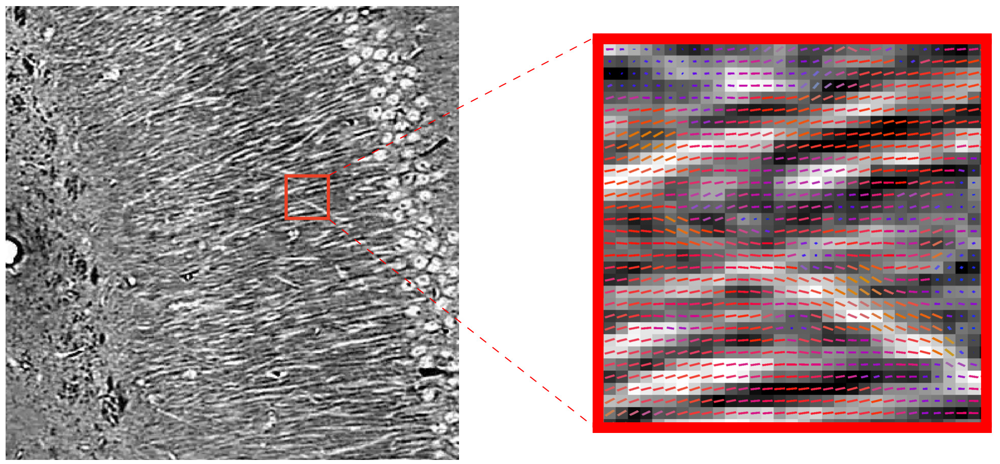
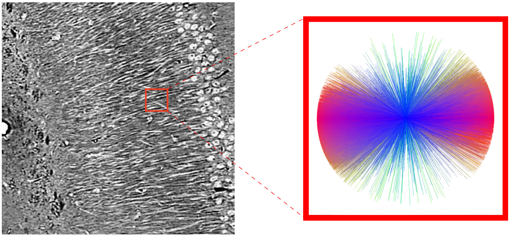
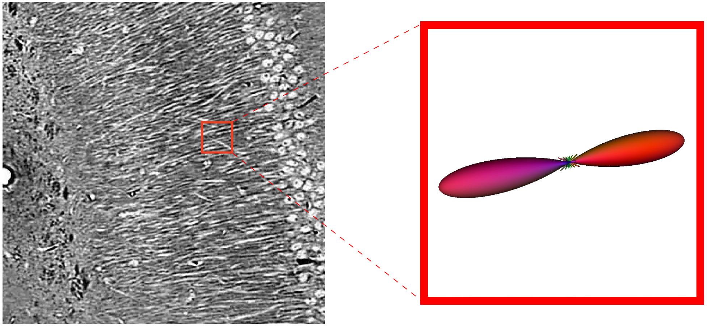
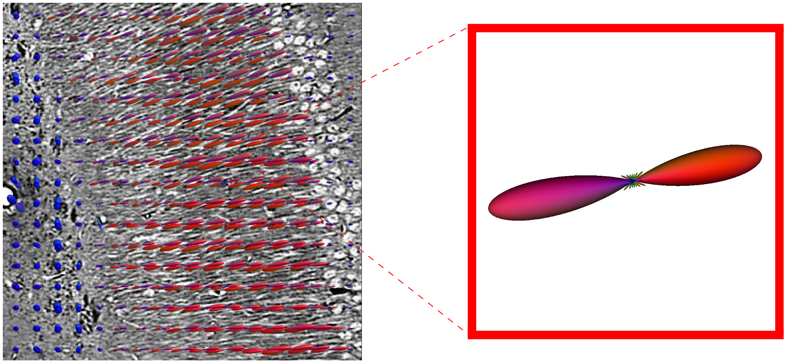
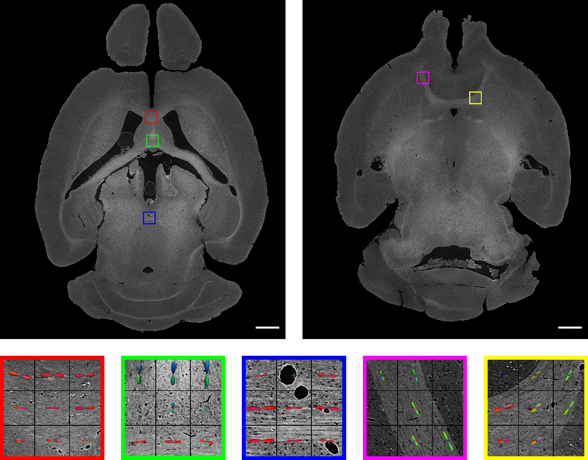
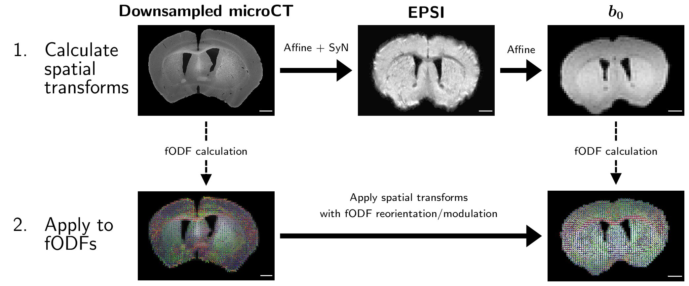
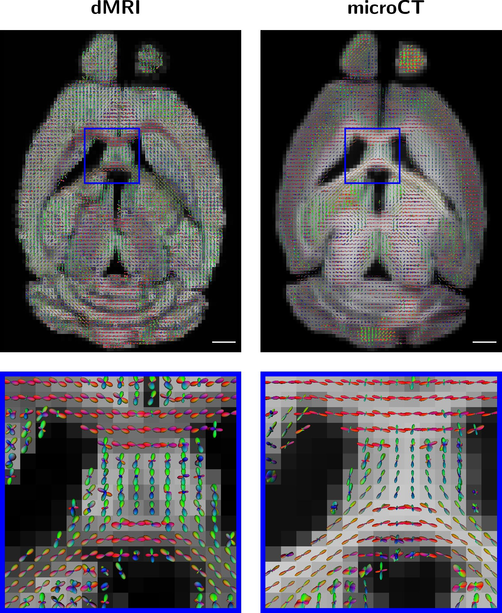
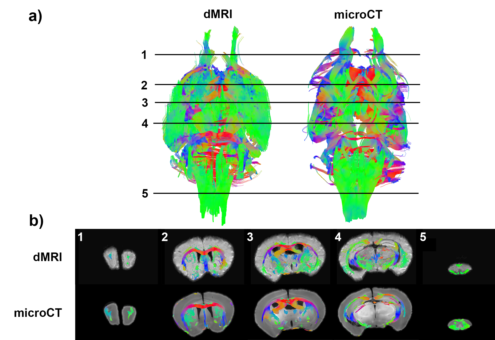

My first-author paper "[Synchrotron X-ray micro-CT as a validation dataset for
diffusion MRI in whole mouse
brain](https://onlinelibrary.wiley.com/doi/10.1002/mrm.28776)" has been
published in Magnetic Resonance in Medicine. This project has been a huge effort
from myself and collaborators at the University of Chicago and Argonne National
Laboratory and I'm really excited to see it go out into the world!

# Highlights

- I developed a 4D spatio-angular registration pipeline between a ~10 TB microCT
dataset and a ~100 MB diffusion MRI dataset of the same mouse brain
- I developed computer vision tools to extract local nerve fiber orientations from high-resolution
microCT data and bin them as an angular distribution on a basis of spherical harmonic functions
- I demonstrated the feasibility of using microCT as a validation dataset for diffusion MRI

# Motivation

Diffusion MRI is sensitive to the diffusion coefficient of water along a given
direction. By acquiring 3D images along multiple different directions, the data
can be reconstructed to give an estimate of the distribution of nerve fiber
orientations at each point in space - a so-called **"fiber orientation distribution
function" (fODF)** .  Metrics derived from fODFs have clinical utility in
diagnosing diseases that affect white matter integrity. fODFs can also be used to
estimate structural connectivity across the brain with fiber tractography.

There are a number of approaches for performing this reconstruction, but all of them
require validation with some sort of additionaly high-resolution imaging because
**the MRI resolution is not enough to verify the fiber orientations**.

Most studies in the past have used optical microscopy as this validation imaging
tool, which works well but is very labor-intensive and requires physically
slicing a tissue-sample due to the low penetration depth of optical light.  This
leads to non-uniform resolution in 3D because the thickness of the slice is
typically much thicker than the in-plane resolution of the microscope.

To address this, this paper introduces data from a whole mouse brain collected
at the Advanced Photon Source (APS) synchrotron at Argonne National
Laboratory. With the powerful x-rays at APS, we can image a whole mouse brain
with ~1 micron resolution without having to slice or destroy the sample. This
resolution allows us to visualize individual cell bodies and axons:

In the paper, we demonstrate how this type of data can be used to validate diffusion MRI.

# Strategy

The primary question we want to answer is: **How well does diffusion MRI recover
the true orientations of nerve fibers across the brain?**

In order to do that, we need to do the following:

1. Extract the fiber orientations from the high-resolution microCT data
2. Spatially register the two datasets for fair evaluation of diffusion MRI

## Feature extraction

Local fiber orientations were extracted from the microCT data using a computer
vision technique called **structure tensor analysis**. To quickly summarize,
structure tensor analysis uses eigenanalysis of local tensors formed by image
gradient vectors to estimate the local 3D orientation with the smallest change
in intensity value within a predefined neighborhood. We assume that for voxels
containing nerve fibers, this orientation points along the main axis of the
fiber.

In other words the algorithm takes an image of nerve fibers, and measures the
vector of nerve fiber orientations at every pixel, as shown below, where the
color of the vetor represents direction (left-right: red, up-down: green,
in-out: blue).

Now that we know the fiber orientations, we need to find a way to fairly compare
them to the low-resolution diffusion MRI results, since there are roughly **2
million microCT voxels for every single MRI voxel**. Specifically, we want to
bin individual vectors together into an fODF defined on the same scale as the MRI
resolution.

First, we define a 3D cube of space in the microCT data and group all of the
vectors within that cube into an angular histogram:

Then, we express our histogram on a basis of spherical harmonic functions to get
an fODF. This is the same format of orientation estimate produced by the
diffusion MRI reconstruction.

The key is that when we binned the vectors together to make our angular
histogram, we chose a 3D cube equal in size to an MRI voxel, so now we
have a 3D grid of fODFs on the same scale as the MRI data and can fairly compare
them after spatial registration. 

See more fODF results from the xray data below:

## Spatial registration

Now that we have fODFs from both modality on the same scale, we need
to align the voxel grids so that we can fairly compare individual 
orientation estimates. 

With optical imaging, this registration task is challening since you are
typically dealing with digital stacks of 2D images. The massive advantage of
using the whole-brain microCT data with the structure-tensor processing step is
that the data is already in the same format as the MRI reconstruction, and the
scale difference has already been taken care of, so we can use existing
registration packages. 

An overview of our registration pipeline is shown below:

To summarize, we first perform purely spatial registrations using the
[ANTS package](http://stnava.github.io/ANTs/):
1. We downsample the microCT intensity data and perform nonlinear
registration to a structural MRI voxel (EPSI)
2. We perform a linear registration from our higher-resolution EPSI
data to our low-resolution diffusion data (b0)

We then concatenate both transforms and apply them to the microCT fODFs, using
[MRTrix3](https://www.mrtrix.org/) to account for reorientation and modulation
of the fODFs.

When all is said in done, we get a result like this:

The microCT fODFs were derived from actual computational measurements of
the underlying nerve fiber orientations, so they can be used in future studies
to benchmark different diffusion MRI approaches. 

# Tractography

It is extremely difficult to perform whole-brain validation with optical methods
due to the issues with 3D alignment I brought up earlier. So another bonus to
using microCT is that it allows you to use fiber tractography algorithms
on structure-tensor derived fODFs and evaluate how biased fODFs from diffusion
MRI affect tractography performance:

