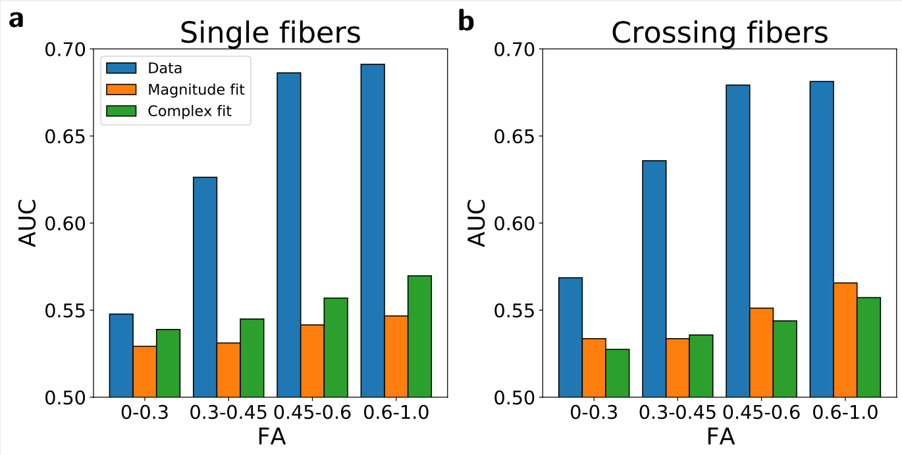
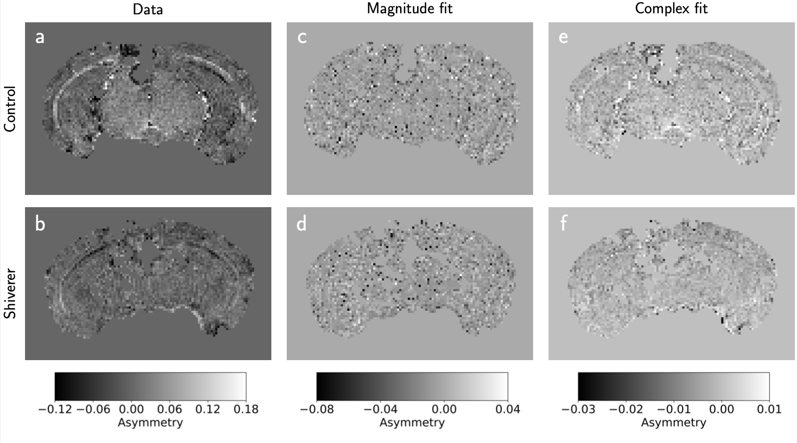

My first-author paper ["The role of spatial embedding in mouse brain networks
constructed from diffusion tractography and tracer
injections"](https://www.biorxiv.org/content/10.1101/2022.02.24.481824v1) has
been published online as a preprint at bioRxiv.

# Highlights

- A model-free asymmetry metric shows promising performance classifying control-
  from dysmyelinated white matter voxels.
- After fitting the same data to common time-domain biophysical models,
  classification performance is reduced.
- This demonstrates biases in the underlying models and motivates future
  development of spectral analysis methods

# Motivation

Echo-planar spectroscopic imaging (EPSI) (AKA multi-gradient echo) is a form of
MRI imaging that yields a water resonance spectrum at every point in 3D
space. These data are commonly fit to time-domain biophysical signal models in
order to estimate relative volumes of myelin, a lipid bilayer that coats axons
and is implicated in various dysmyelination disorders such as multiple
sclerosis.

The purpose of this project was to demonstrate that with extended temporal
sampling of the EPSI data, a model-free approach outperforms common model-based
approaches in terms of classifying the presence of myelin.

Our dataset included 5 control mice brains and 4 "shiverer" mice
brains. "Shiverer" mice have compromised myelin sheaths around their axons,
allowing us to isolate the presence of myelin in our analysis.

# Strategy

Based on [previous
work](https://onlinelibrary.wiley.com/doi/abs/10.1002/mrm.28440), we focus on
spectral asymmetry as our primary univariate classifier of myelin. We compare
spectral asymmetry measured directly from the EPSI data to the asymmetry of
spectra predicted after fitting time-domain data to two biophysical models.

We also used several metrics from diffusion MRI acquisitions to explore the
models' performance under different microstructural environments, including a
white-matter integrity metric called fractional anisotropy (FA), as well as an
indicator of whether or not a voxel contains a single or multiple crossing fiber
populations.

# Results

At all FA levels and in voxels with both single and crossing fibers,
the model-free asymmetry had a much higher area under the ROC curve (AUC)
than either of the model-based approaches:

The model-free sensitivity to myelin was also notably higher when looking at
spectral asymmetry images, where the model-free ("Data") image shows notably
higher white-matter contrast than either of the model-based approaches:

Our results confirm biases in existing, common biophysical models and promote
the further development of spectral analysis methods to benchmark new
model-based approaches.
