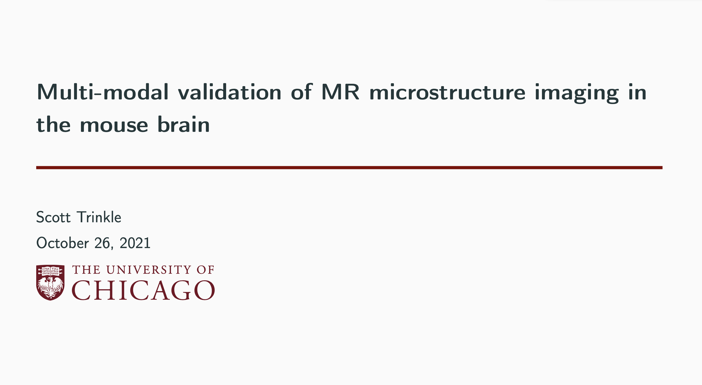

I successfully defended my thesis entitled "Multi-modal validation of MR microstructure imaging in the mouse brain." My thesis is
available to read [here](https://www.proquest.com/openview/5ce6c9b022b339d81e3cd47cc0cdf8fa/1?pq-origsite=gscholar&cbl=18750&diss=y).

<blockquote class="twitter-tweet">
Congratulations to Dr. Scott Trinkle for successfully defending his thesis this morning on &quot;Multi-modal validation of MR microstructure imaging in the mouse brain.&quot; Amazing work! <a href="https://t.co/Mop3pRpn88">pic.twitter.com/Mop3pRpn88</a>
&mdash; UChicago Medical Physics (@UChicagoMedPhys) <a href="https://twitter.com/UChicagoMedPhys/status/1453043943206227969?ref_src=twsrc%5Etfw">October 26, 2021</a></blockquote> 
