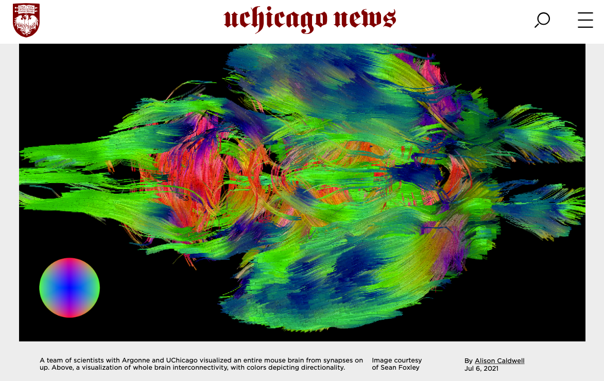

Work from our NeuroImage manuscript "[Multi-modal imaging of a single mouse
brain over five orders of magnitude of
resolution](https://www.sciencedirect.com/science/article/pii/S1053811921005279?via%3Dihub)"
was profiled for UChicago News. [Click
here](https://news.uchicago.edu/story/researchers-image-entire-mouse-brain-first-time?utm_source=dlvr.it&utm_medium=twitter)
to read the article featuring interviews with my collaborators on the important
advances of this new imaging pipeline, and [click
here](/news/imaging-pipeline-paper/) to read my blog post about the project.
